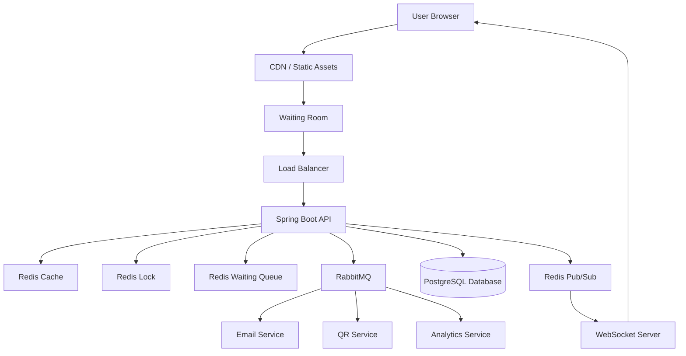
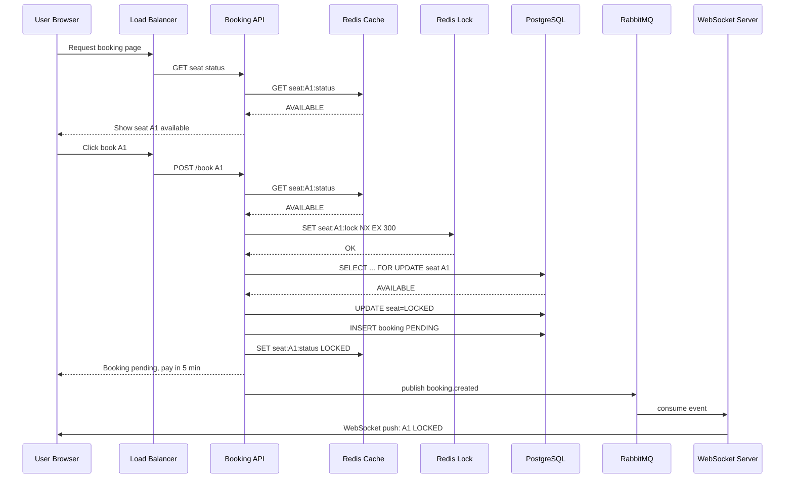
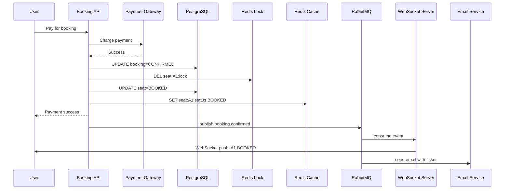
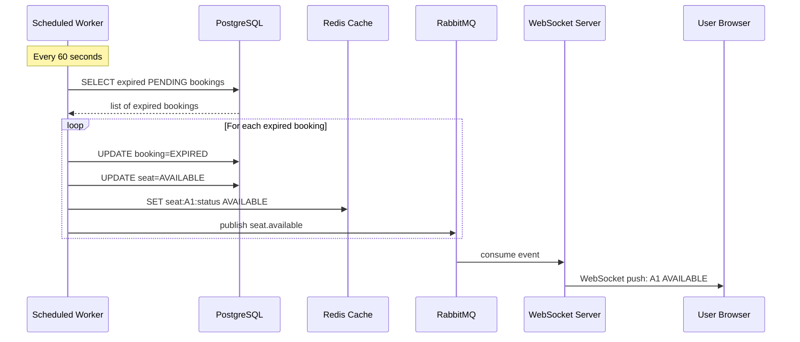
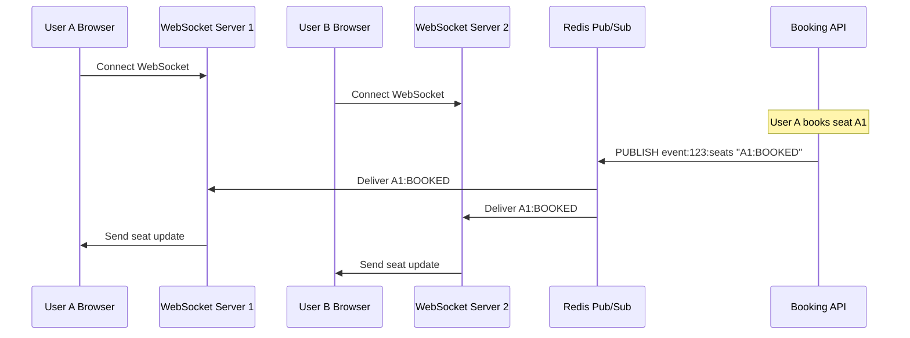
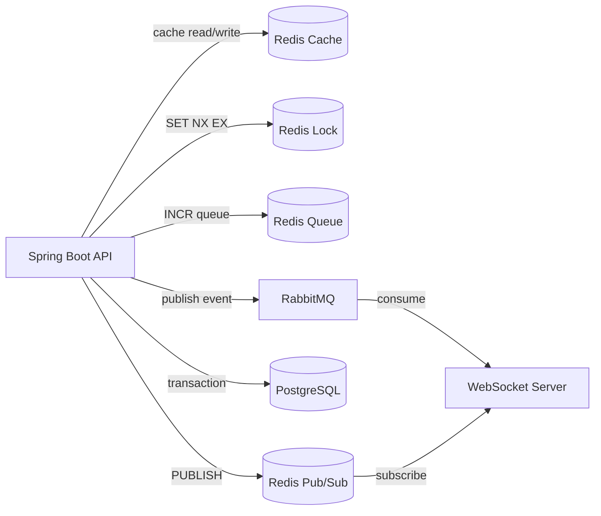
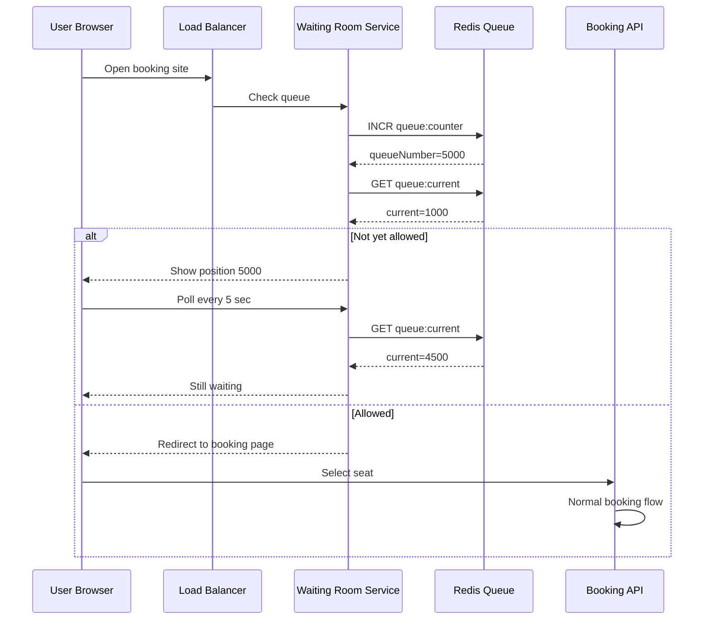
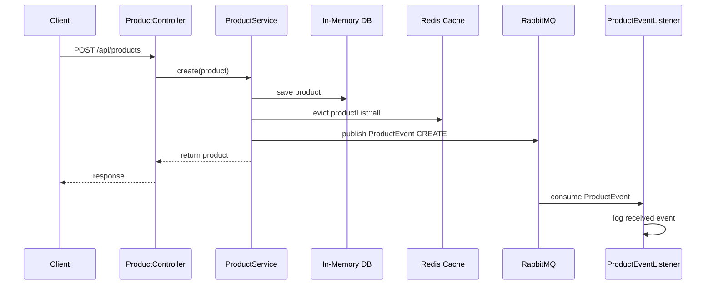

# Mermaid Flow Diagrams

ไฟล์นี้รวม mermaid diagrams สำหรับระบบ Redis + RabbitMQ + WebSocket + Ticketing

---

## Table of Contents

1. [High-Level Architecture](#1-high-level-architecture)
2. [User Booking Flow](#2-user-booking-flow)
3. [Payment Success Flow](#3-payment-success-flow)
4. [Expired Booking Cleanup Flow](#4-expired-booking-cleanup-flow)
5. [WebSocket Multi-Server with Redis Pub/Sub](#5-websocket-multi-server-with-redis-pubsub)
6. [Multi-Redis Architecture](#6-multi-redis-architecture)
7. [Waiting Room Flow](#7-waiting-room-flow)
8. [Redis + RabbitMQ Project Flow](#8-redis--rabbitmq-project-flow)

---

## 1. High-Level Architecture

---

## 2. User Booking Flow

---

## 3. Payment Success Flow

---

## 4. Expired Booking Cleanup Flow

---

## 5. WebSocket Multi-Server with Redis Pub/Sub

---

## 6. Multi-Redis Architecture

---

## 7. Waiting Room Flow

---

## 8. Redis + RabbitMQ Project Flow

---

## หมายเหตุ

mermaid diagrams อาจไม่ render ในทุก editor แต่ support ใน:
- GitHub / GitLab
- VS Code with Mermaid extension
- Markdown viewer ที่ support mermaid 
- Obsidian
