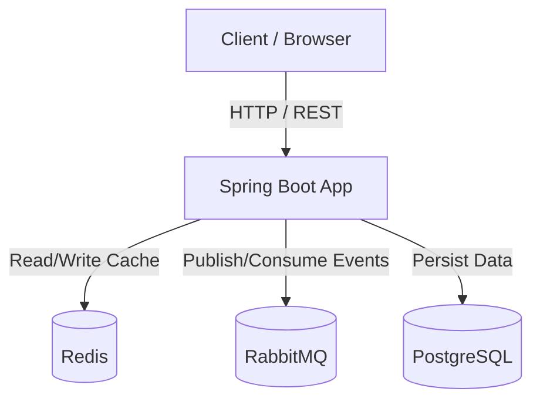

# Spring Boot Cache & Messaging Demo

[](https://openjdk.org/)
[](https://spring.io/projects/spring-boot)
[](https://maven.apache.org/)
[](https://redis.io/)
[](https://www.rabbitmq.com/)
[](https://www.postgresql.org/)
[](https://www.docker.com/)

โปรเจคนี้เป็น REST API สำหรับจัดการสินค้า (Product) โดยใช้ **Spring Boot 3.4.5** ร่วมกับ **PostgreSQL** เป็น database หลัก **Redis** เป็น Cache Layer เพื่อลดเวลาการตอบสนองของ API ที่ถูกเรียกซ้ำ และ **RabbitMQ** สำหรับส่ง async events

## Architecture



---

## 1. วิธีใช้งาน (Quick Start)

### 1.1 รันทั้งหมดด้วย Docker Compose (แนะนำ)

```bash
# Build + start Spring Boot + PostgreSQL + Redis + RabbitMQ
docker-compose up --build -d

# ดู log
docker-compose logs -f app

# หยุดทั้งหมด
docker-compose down
```

เข้าใช้งานได้ที่:
- API: http://localhost:8080/api/products
- Swagger UI: http://localhost:8080/swagger-ui.html
- RabbitMQ Management UI: http://localhost:15672 (guest/guest)
- Redis: localhost:6379
- PostgreSQL: localhost:5432 (products / postgres / postgres)

### 1.2 รันผ่าน Maven (ต้องมี PostgreSQL + Redis เอง)

```bash
# เปิด PostgreSQL + Redis ก่อน
docker run -d --name postgres -e POSTGRES_DB=products -e POSTGRES_USER=postgres -e POSTGRES_PASSWORD=postgres -p 5432:5432 postgres:16-alpine
docker run -d --name redis -p 6379:6379 redis:7-alpine

# Run app
mvn spring-boot:run
```

### 1.3 รัน Unit Tests

```bash
mvn test
```

### 1.4 ทดสอบผ่าน Swagger UI

หลัง app start เปิดที่:

```
http://localhost:8080/swagger-ui.html
```

หรือดู OpenAPI spec:

```
http://localhost:8080/v3/api-docs
```

### 1.5 ทดสอบผ่าน Postman

Import ไฟล์นี้เข้า Postman:

```
.postman/spring-boot-cache-messaging-demo.postman_collection.json
```

### 1.6 ทดสอบ API ด้วย curl

```bash
# ดูสินค้าทั้งหมด
curl http://localhost:8080/api/products

# ดูสินค้ารายชิ้น
curl http://localhost:8080/api/products/1

# สร้างสินค้าใหม่
curl -X POST http://localhost:8080/api/products \
  -H "Content-Type: application/json" \
  -d '{"name":"Headphone","price":99.99}'

# อัปเดตสินค้า
curl -X PUT http://localhost:8080/api/products/1 \
  -H "Content-Type: application/json" \
  -d '{"name":"Gaming Keyboard","price":89.99}'

# ลบสินค้า
curl -X DELETE http://localhost:8080/api/products/1
```

### 1.5 ความต้องการของระบบ

- Java 21+
- Maven 3.9+
- Docker + Docker Compose (ถ้ารันแบบ containerized)

---

## 2. ภาพรวมระบบ

- **Spring Boot** ทำหน้าที่เป็น backend framework และ REST API server
- **PostgreSQL** ทำหน้าที่เป็น **database หลัก** เก็บข้อมูลสินค้าจริง
- **Redis** ทำหน้าที่เป็น **cache store** เพื่อลดเวลาการตอบสนองของ API ที่ถูกเรียกซ้ำ
- **RabbitMQ** ทำหน้าที่เป็น **message broker** ส่ง async events เมื่อสินค้าถูกสร้าง/อัปเดต/ลบ
- ข้อมูล cache จะถูก invalidate เมื่อมีการเปลี่ยนแปลงข้อมูลสินค้า

---

## 3. Tech Stack

| เทคโนโลยี | หน้าที่ |
|-----------|---------|
| Spring Boot 3.4.5 | Backend framework + REST API |
| Spring Data JPA | เชื่อมต่อ PostgreSQL |
| PostgreSQL 16 | Database หลัก |
| Spring Data Redis | เชื่อมต่อ Redis |
| Spring Cache | ทำ caching ด้วย annotation |
| RabbitMQ 3 | Async messaging |
| SpringDoc OpenAPI | API documentation / Swagger UI |
| Redis 7 (Docker) | Cache server |
| Maven | Build tool |
| Java 21 | Runtime |

---

## 4. โครงสร้างไฟล์

| ไฟล์ | หน้าที่ |
|------|--------|
| `RedisDemoApplication.java` | จุดเริ่มต้นแอพ + เปิดใช้ `@EnableCaching` |
| `config/CacheConfig.java` | ตั้งค่า `CacheManager` ให้ใช้ Redis แทน in-memory cache |
| `controller/ProductController.java` | รับ HTTP request จาก client |
| `service/ProductService.java` | ธุรกิจลอจิก + cache annotations + ส่ง events |
| `repository/ProductRepository.java` | JPA Repository สำหรับ CRUD กับ PostgreSQL |
| `model/Product.java` | JPA Entity / Model class ของสินค้า |
| `service/ProductNotFoundException.java` | Exception สำหรับสินค้าที่หาไม่เจอ |
| `exception/GlobalExceptionHandler.java` | จัดการ exception ทั้งหมด |
| `config/RequestIdFilter.java` | เพิ่ม request ID ให้ทุก request |
| `resources/application.properties` | ค่า config เช่น datasource, Redis, RabbitMQ |
| `pom.xml` | Dependencies ของ Maven |

---

## 5. Dependencies หลัก (pom.xml)

```xml
<dependency>
    <groupId>org.springframework.boot</groupId>
    <artifactId>spring-boot-starter-web</artifactId>
</dependency>
<dependency>
    <groupId>org.springframework.boot</groupId>
    <artifactId>spring-boot-starter-data-redis</artifactId>
</dependency>
<dependency>
    <groupId>org.springframework.boot</groupId>
    <artifactId>spring-boot-starter-cache</artifactId>
</dependency>
```

| Dependency | หน้าที่ |
|------------|---------|
| `spring-boot-starter-web` | สร้าง REST API + Tomcat server |
| `spring-boot-starter-data-redis` | เชื่อมต่อ Redis |
| `spring-boot-starter-cache` | ให้ใช้ `@Cacheable`, `@CachePut`, `@CacheEvict` |

---

## 6. การเปิดใช้ Caching

ใน `RedisDemoApplication.java`:

```java
@EnableCaching
@SpringBootApplication
public class RedisDemoApplication {
    public static void main(String[] args) {
        SpringApplication.run(RedisDemoApplication.class, args);
    }
}
```

- `@SpringBootApplication` บอก Spring ว่านี่เป็นแอพหลัก
- `@EnableCaching` เปิดใช้ Spring Cache abstraction

---

## 7. การตั้งค่า Redis (application.properties)

```properties
spring.application.name=spring-redis-demo

spring.data.redis.host=localhost
spring.data.redis.port=6379
spring.cache.type=redis

server.port=8080
```

| ค่า | ความหมาย |
|------|----------|
| `spring.data.redis.host=localhost` | Redis รันที่เครื่องเดียวกับ Spring Boot |
| `spring.data.redis.port=6379` | พอร์ตเริ่มต้นของ Redis |
| `spring.cache.type=redis` | บอก Spring ให้ใช้ Redis เป็น cache store |
| `server.port=8080` | Spring Boot รันบนพอร์ต 8080 |

---

## 8. การตั้งค่า CacheManager (CacheConfig.java)

```java
@Configuration
public class CacheConfig {

    @Bean
    public CacheManager cacheManager(RedisConnectionFactory connectionFactory) {
        RedisCacheConfiguration config = RedisCacheConfiguration.defaultCacheConfig()
                .entryTtl(Duration.ofMinutes(10))
                .serializeKeysWith(RedisSerializationContext.SerializationPair.fromSerializer(new StringRedisSerializer()))
                .serializeValuesWith(RedisSerializationContext.SerializationPair.fromSerializer(new GenericJackson2JsonRedisSerializer()))
                .disableCachingNullValues();

        return RedisCacheManager.builder(connectionFactory)
                .cacheDefaults(config)
                .build();
    }
}
```

| ส่วน | ความหมาย |
|------|----------|
| `@Configuration` | บอก Spring ว่า class นี้มีการตั้งค่า Bean |
| `CacheManager cacheManager(...)` | สร้าง Bean ที่ Spring Cache จะนำไปใช้ |
| `RedisConnectionFactory` | Spring Boot สร้างอัตโนมัติจาก `application.properties` |
| `.entryTtl(Duration.ofMinutes(10))` | ข้อมูลใน cache หมดอายุหลัง 10 นาที |
| `StringRedisSerializer` | แปลง **cache key** ให้เป็น String |
| `GenericJackson2JsonRedisSerializer` | แปลง **cache value** ให้เป็น JSON |
| `.disableCachingNullValues()` | ห้าม cache ค่า null |

### ทำไมต้อง serialize?

Redis เก็บข้อมูลเป็น **byte array** ไม่ใช่ Java object ดังนั้นต้องแปลง:
- **Key** → `String` เช่น `products::1`
- **Value** → JSON เช่น `{"id":1,"name":"Keyboard",...}`

---

## 9. Model: Product.java

```java
public class Product implements Serializable {

    private Long id;
    private String name;
    private BigDecimal price;

    public Product() {}
    public Product(Long id, String name, BigDecimal price) { ... }

    public Long getId() { return id; }
    public String getName() { return name; }
    public BigDecimal getPrice() { return price; }
}
```

| ส่วน | ความหมาย |
|------|----------|
| `implements Serializable` | ทำให้ Java สามารถแปลง object เป็น bytes ได้ |
| default constructor `Product()` | จำเป็นสำหรับ Jackson ในการ deserialize JSON กลับเป็น object |
| getters | Jackson ใช้แปลง object → JSON และอ่านค่ากลับ |

---

## 10. Service: ProductService.java

```java
@Service
public class ProductService {

    public static final String PRODUCT_CACHE = "products";
    public static final String PRODUCT_LIST_CACHE = "productList";

    private final Map<Long, Product> db = new ConcurrentHashMap<>();
    private final AtomicLong idGen = new AtomicLong(0);

    public ProductService() {
        create(new Product(null, "Keyboard", new BigDecimal("59.99")));
        create(new Product(null, "Mouse", new BigDecimal("29.99")));
        create(new Product(null, "Monitor", new BigDecimal("199.99")));
    }

    @Cacheable(cacheNames = PRODUCT_CACHE, key = "#id")
    public Product getById(Long id) { ... }

    @Cacheable(cacheNames = PRODUCT_LIST_CACHE, key = "'all'")
    public List<Product> getAll() { ... }

    @CacheEvict(cacheNames = PRODUCT_LIST_CACHE, allEntries = true)
    public Product create(Product request) { ... }

    @Caching(
        put = {@CachePut(cacheNames = PRODUCT_CACHE, key = "#id")},
        evict = {@CacheEvict(cacheNames = PRODUCT_LIST_CACHE, allEntries = true)}
    )
    public Product update(Long id, Product request) { ... }

    @Caching(evict = {
        @CacheEvict(cacheNames = PRODUCT_CACHE, key = "#id"),
        @CacheEvict(cacheNames = PRODUCT_LIST_CACHE, allEntries = true)
    })
    public void delete(Long id) { ... }

    private void simulateSlowQuery() {
        Thread.sleep(2000); // จำลอง query ช้า
    }
}
```

### Annotation ที่ใช้

| Annotation | ความหมาย |
|------------|----------|
| `@Cacheable` | ถ้าข้อมูลมีใน cache คืนค่าจาก cache ทันที ถ้าไม่มีให้รัน method แล้ว cache ผลลัพธ์ |
| `@CachePut` | รัน method แล้วอัปเดตค่าใน cache |
| `@CacheEvict` | ลบค่าออกจาก cache |
| `@Caching` | ใช้รวมหลาย annotation ไว้ด้วยกัน |

### ข้อสังเกต

- `db` เป็น **in-memory map** ทำหน้าที่เหมือนฐานข้อมูล
- `simulateSlowQuery()` sleep 2 วินาที เพื่อจำลองการ query ที่ช้า
- ข้อมูลเริ่มต้น 3 รายการถูกสร้างใน constructor

---

## 11. Controller: ProductController.java

```java
@RestController
@RequestMapping("/api/products")
public class ProductController {

    private final ProductService service;

    @GetMapping
    public List<Product> getAll() { return service.getAll(); }

    @GetMapping("/{id}")
    public Product getById(@PathVariable Long id) { return service.getById(id); }

    @PostMapping
    @ResponseStatus(HttpStatus.CREATED)
    public Product create(@RequestBody Product product) { return service.create(product); }

    @PutMapping("/{id}")
    public Product update(@PathVariable Long id, @RequestBody Product product) { return service.update(id, product); }

    @DeleteMapping("/{id}")
    @ResponseStatus(HttpStatus.NO_CONTENT)
    public void delete(@PathVariable Long id) { service.delete(id); }

    @ExceptionHandler(ProductNotFoundException.class)
    public ResponseEntity<Map<String, String>> handleNotFound(ProductNotFoundException ex) { ... }
}
```

| Endpoint | Method | ทำอะไร |
|----------|--------|--------|
| `/api/products` | GET | ดูสินค้าทั้งหมด |
| `/api/products/{id}` | GET | ดูสินค้าตาม id |
| `/api/products` | POST | สร้างสินค้าใหม่ |
| `/api/products/{id}` | PUT | อัปเดตสินค้า |
| `/api/products/{id}` | DELETE | ลบสินค้า |

---

## 12. Flow การทำงานแบบละเอียด

### 11.1 `GET /api/products/{id}` — ดูสินค้าตาม id

```java
@Cacheable(cacheNames = PRODUCT_CACHE, key = "#id")
public Product getById(Long id) {
    simulateSlowQuery();
    Product product = db.get(id);
    if (product == null) {
        throw new ProductNotFoundException(id);
    }
    return product;
}
```

**Flow:**

```
Client ขอ GET /api/products/1
        ↓
ProductController.getById(1)
        ↓
ProductService.getById(1)
        ↓
Spring Cache Interceptor ตรวจ Redis key "products::1"
        │
        ├─ Cache HIT → คืนค่าจาก Redis ทันที (เร็ว ~50-100 ms)
        │
        └─ Cache MISS
                ↓
            simulateSlowQuery() sleep 2 วินาที
                ↓
            อ่านจาก db.get(1)
                ↓
            เก็บผลลัพธ์ลง Redis key "products::1"
                ↓
            คืนค่าให้ client
```

- **Redis key:** `products::1`
- **TTL:** 10 นาที

---

### 11.2 `GET /api/products` — ดูสินค้าทั้งหมด

```java
@Cacheable(cacheNames = PRODUCT_LIST_CACHE, key = "'all'")
public List<Product> getAll() {
    simulateSlowQuery();
    return new ArrayList<>(db.values());
}
```

**Flow:**

```
Client ขอ GET /api/products
        ↓
ProductController.getAll()
        ↓
ProductService.getAll()
        ↓
Spring Cache ตรวจ Redis key "productList::all"
        │
        ├─ Cache HIT → คืนค่าจาก Redis
        │
        └─ Cache MISS
                ↓
            simulateSlowQuery() sleep 2 วินาที
                ↓
            อ่านทุกค่าจาก db.values()
                ↓
            เก็บผลลัพธ์ลง Redis key "productList::all"
                ↓
            คืนค่าเป็น JSON array
```

- **Redis key:** `productList::all`

---

### 11.3 `POST /api/products` — สร้างสินค้าใหม่

```java
@CacheEvict(cacheNames = PRODUCT_LIST_CACHE, allEntries = true)
public Product create(Product request) {
    long id = idGen.incrementAndGet();
    Product product = new Product(id, request.getName(), request.getPrice());
    db.put(id, product);
    return product;
}
```

**Flow:**

```
Client ส่ง JSON { "name": "Laptop", "price": 999.99 }
        ↓
ProductController.create(product)
        ↓
ProductService.create(product)
        ↓
สร้าง id ใหม่ → เก็บลง db
        ↓
@CacheEvict ลบ Redis key "productList::all" ทิ้ง
        ↓
คืนค่า product ใหม่
```

**ทำไมต้องลบ `productList::all`?** เพราะ list สินค้าเปลี่ยนแล้ว cache เก่าจึงไม่ถูกต้อง

---

### 11.4 `PUT /api/products/{id}` — อัปเดตสินค้า

```java
@Caching(
    put = {@CachePut(cacheNames = PRODUCT_CACHE, key = "#id")},
    evict = {@CacheEvict(cacheNames = PRODUCT_LIST_CACHE, allEntries = true)}
)
public Product update(Long id, Product request) { ... }
```

**Flow:**

```
Client ส่ง PUT /api/products/1 + JSON
        ↓
อัปเดต db
        ↓
@CachePut → อัปเดต Redis key "products::1"
@CacheEvict → ลบ Redis key "productList::all"
        ↓
คืนค่า product ที่อัปเดต
```

---

### 11.5 `DELETE /api/products/{id}` — ลบสินค้า

```java
@Caching(evict = {
    @CacheEvict(cacheNames = PRODUCT_CACHE, key = "#id"),
    @CacheEvict(cacheNames = PRODUCT_LIST_CACHE, allEntries = true)
})
public void delete(Long id) { ... }
```

**Flow:**

```
Client ส่ง DELETE /api/products/1
        ↓
ลบออกจาก db
        ↓
ลบ Redis key "products::1"
ลบ Redis key "productList::all"
        ↓
คืน HTTP 204 No Content
```

---

## 13. รูปแบบข้อมูลใน Redis (Jackson Type Info)

เมื่อดูด้วย `redis-cli`:

```bash
GET productList::all
```

ผลลัพธ์:

```json
["java.util.ArrayList",[
  {"@class":"com.example.redisdemo.model.Product","id":1,"name":"Keyboard","price":["java.math.BigDecimal",59.99]},
  {"@class":"com.example.redisdemo.model.Product","id":2,"name":"Mouse","price":["java.math.BigDecimal",29.99]},
  {"@class":"com.example.redisdemo.model.Product","id":3,"name":"Monitor","price":["java.math.BigDecimal",199.99]}
]]
```

JSON ที่เห็นอาจดูยุ่งๆ แต่มีเหตุผลสำคัญ

### 12.1 ทำไม JSON ถึงดูยุ่ง?

เพราะ **Jackson ใส่ Type Information เข้าไปใน JSON** เพื่อให้แปลงกลับมาเป็น Java object ได้ถูกต้อง

เปรียบเทียบ:

#### JSON ธรรมดา (ไม่มี type info)

```json
[
  {"id":1,"name":"Keyboard","price":59.99},
  {"id":2,"name":"Mouse","price":29.99}
]
```

ปัญหา: ถ้า Jackson อ่าน JSON นี้กลับมา จะได้ `List<LinkedHashMap>` หรือ `ArrayList` ที่ไม่รู้ว่าเป็น `Product`

#### JSON ที่มี Jackson Type Info

```json
["java.util.ArrayList",[
  {"@class":"com.example.redisdemo.model.Product","id":1,"name":"Keyboard","price":["java.math.BigDecimal",59.99]},
  {"@class":"com.example.redisdemo.model.Product","id":2,"name":"Mouse","price":["java.math.BigDecimal",29.99]}
]]
```

ข้อดี: Jackson แปลงกลับมาเป็น `ArrayList<Product>` ได้ถูกต้อง

### 12.2 แต่ละส่วนหมายความว่าอย่างไร?

| ส่วน | ความหมาย |
|------|----------|
| `["java.util.ArrayList", [...]]` | Jackson บอกว่าข้อมูล root เป็น `ArrayList` (เพราะ `List` เป็น polymorphic type) |
| `"@class":"com.example.redisdemo.model.Product"` | บอกว่า object นี้เป็น class `Product` |
| `["java.math.BigDecimal", 59.99]` | บอกว่า field `price` เป็น `BigDecimal` ไม่ใช่ `Double` หรือ `String` |

### 12.3 ใครเป็นคนเพิ่ม type info?

มาจาก `GenericJackson2JsonRedisSerializer` ใน `CacheConfig.java`:

```java
.serializeValuesWith(
    RedisSerializationContext.SerializationPair.fromSerializer(
        new GenericJackson2JsonRedisSerializer()
    )
)
```

`GenericJackson2JsonRedisSerializer` จะสร้าง `ObjectMapper` ที่เปิดใช้งาน **Jackson Default Typing** ให้อัตโนมัติ ซึ่งจะเพิ่ม type info เข้าไปในทุก non-final class

### 12.4 ถ้าไม่มี type info จะเกิดอะไรขึ้น?

อาจเกิด error เช่น:

```text
SerializationException: Could not read JSON:
Unexpected token (START_OBJECT), expected VALUE_STRING:
need String, Number or Boolean value that contains type id
```

หรือถ้าไม่ error ก็อาจได้ object ผิด type:

```java
List<Product> products = ...; // อาจกลายเป็น ArrayList<LinkedHashMap> ทำให้ ClassCastException
```

### 12.5 ถ้าอยากให้ JSON สะอาดกว่านี้?

มีทางเลือก:

| วิธี | ข้อดี | ข้อเสีย |
|------|-------|---------|
| ใช้ `JdkSerializationRedisSerializer` | JSON ไม่ยุ่ง เก็บเป็น binary | อ่านใน `redis-cli` ไม่ออก |
| Custom `ObjectMapper` ไม่ใช้ default typing | JSON สะอาด | ต้องจัดการ deserialize เอง |
| ใช้ `Jackson2JsonRedisSerializer<Product>` | JSON สะอาด | ใช้ได้กับ cache ที่มี type เดียว |

ในโปรเซคนี้เลือก `GenericJackson2JsonRedisSerializer` เพื่อให้อ่านข้อมูลใน Redis ได้ พร้อมรองรับ polymorphic type

---

## 14. ปัญหาที่เกิดขึ้นระหว่างพัฒนา และวิธีแก้

### ปัญหา 1: `/api/products` ได้ 500 (SerializationException)

**สาเหตุ:** `ProductService.getAll()` เดิมใช้ `List.copyOf(db.values())` ซึ่งคืน `ImmutableCollections$ListN` — Jackson ไม่สามารถ serialize/deserialize เป็น polymorphic type ได้ดี

**แก้ไข:** เปลี่ยนเป็น `new ArrayList<>(db.values())`:

```java
@Cacheable(cacheNames = PRODUCT_LIST_CACHE, key = "'all'")
public List<Product> getAll() {
    simulateSlowQuery();
    return new ArrayList<>(db.values());
}
```

### ปัญหา 2: ข้อมูลเก่าใน Redis เป็น binary จาก serializer เก่า

**สาเหตุ:** ระหว่างทดสองเปลี่ยน serializer หลายรอบ ข้อมูลเก่าใน Redis ค้างอยู่

**แก้ไข:** ล้าง Redis ด้วย `FLUSHALL` แล้ว restart Spring Boot ใหม่

---

## 15. วิธีรันและทดสอบ

### 14.1 รัน Redis ด้วย Docker

```bash
docker run --name redis -p 6379:6379 -d redis:7-alpine
```

### 14.2 รัน Spring Boot

```bash
mvn spring-boot:run
```

### 14.3 ทดสอบ API

```bash
# ดูสินค้าทั้งหมด
curl http://localhost:8080/api/products

# ดูสินค้า id 1
curl http://localhost:8080/api/products/1

# สร้างสินค้าใหม่
curl -X POST http://localhost:8080/api/products \
  -H "Content-Type: application/json" \
  -d '{"name":"Laptop","price":999.99}'

# อัปเดตสินค้า
curl -X PUT http://localhost:8080/api/products/1 \
  -H "Content-Type: application/json" \
  -d '{"name":"Mechanical Keyboard","price":89.99}'

# ลบสินค้า
curl -X DELETE http://localhost:8080/api/products/1
```

### 14.4 ตรวจสอบ Redis

```bash
# เข้า redis-cli ผ่าน Docker
docker exec -it redis redis-cli

# หรือถ้าติดตั้ง redis-cli ในเครื่อง
redis-cli

# ดู keys ทั้งหมด
KEYS *

# ดูค่า
GET products::1
GET productList::all

# ดู TTL
TTL products::1

# ดู real-time traffic
MONITOR
```

### 14.5 วัดเวลา cache hit/miss (PowerShell)

```powershell
# ครั้งแรกน่าจะช้า ~2 วินาที (cache miss)
Measure-Command { curl.exe http://localhost:8080/api/products/3 | Out-Null }

# ครั้งที่สองน่าจะเร็ว ~50-100 ms (cache hit)
Measure-Command { curl.exe http://localhost:8080/api/products/3 | Out-Null }
```

---

## 16. จุดที่ต้องจำสำหรับสอบ

1. **Redis ทำหน้าที่อะไรในโปรเจคนี้?** → Cache store ลดการเรียก method ซ้ำ
2. **ข้อมูลจริงเก็บที่ไหน?** → PostgreSQL ผ่าน JPA Repository
3. **Spring Cache ใช้ annotation อะไรบ้าง?** → `@Cacheable`, `@CachePut`, `@CacheEvict`, `@Caching`
4. **Cache key เป็นอย่างไร?** → ชื่อ cache + `::` + key เช่น `products::1`
5. **ทำไมต้อง flush Redis เมื่อเปลี่ยน serializer?** → เพราะข้อมูลเก่า format ไม่ตรงกับ serializer ใหม่
6. **ทำไม `List.copyOf` ทำให้เกิดปัญหา?** → คืน `ImmutableCollections$ListN` ที่ Jackson จัดการ polymorphic type ไม่ดี
7. **StringRedisSerializer ใช้กับอะไร?** → Cache key
8. **GenericJackson2JsonRedisSerializer ใช้กับอะไร?** → Cache value
9. **TTL ของ cache กำหนดที่ไหน?** → `CacheConfig.java` ด้วย `.entryTtl(Duration.ofMinutes(10))`
10. **การอัปเดตข้อมูลทำไมต้อง evict `productList::all`?** → เพราะ list เปลี่ยน ต้องลบ cache เก่าทิ้ง
11. **`@CachePut` ต่างจาก `@Cacheable` อย่างไร?** → `@CachePut` รัน method เสมอแล้วอัปเดต cache, `@Cacheable` ข้ามการรัน method ถ้ามี cache
12. **ทำไมต้องมี default constructor ใน `Product`?** → Jackson ใช้สร้าง object ตอน deserialize
13. **Spring Boot รันบน port อะไร?** → 8080
14. **Redis รันบน port อะไร?** → 6379
15. **การดูข้อมูลใน Redis ต้องใช้ key อะไร?** → `products::{id}` หรือ `productList::all` ไม่ใช่ชื่อสินค้า

---

## 17. RabbitMQ Integration

นอกจาก Redis Cache แล้ว โปรเจคนี้ยังเชื่อมต่อ **RabbitMQ** เพื่อส่ง **async event** เมื่อมีการเปลี่ยนแปลงข้อมูลสินค้า (create/update/delete)

### 16.1 ทำไมต้องใช้ Redis + RabbitMQ คู่กัน?

| ส่วน | หน้าที่ |
|------|---------|
| **Redis** | ลดเวลาการตอบสนองของ API ที่ถูกเรียกซ้ำ (cache) |
| **RabbitMQ** | ส่ง event ให้ service อื่นทำงานต่อแบบ async (decouple) |

ตัวอย่าง: เมื่อสินค้าถูก update ระบบสามารถส่ง event ไปให้:
- Search service อัปเดต Elasticsearch
- Notification service ส่ง email
- Analytics service เก็บ log

### 16.2 ไฟล์ที่เพิ่ม/แก้ไขสำหรับ RabbitMQ

| ไฟล์ | หน้าที่ |
|------|--------|
| `pom.xml` | เพิ่ม `spring-boot-starter-amqp` |
| `config/RabbitConfig.java` | สร้าง queue, exchange, binding |
| `event/ProductEvent.java` | Message payload |
| `listener/ProductEventListener.java` | รับ message จาก queue |
| `service/ProductService.java` | Publish event เมื่อ create/update/delete |
| `application.properties` | ค่า connection RabbitMQ |

### 16.3 RabbitMQ Config (RabbitConfig.java)

```java
@Configuration
public class RabbitConfig {

    public static final String PRODUCT_QUEUE = "product.queue";
    public static final String PRODUCT_EXCHANGE = "product.exchange";
    public static final String PRODUCT_ROUTING_KEY = "product.event";

    @Bean
    public Queue productQueue() {
        return new Queue(PRODUCT_QUEUE, true);
    }

    @Bean
    public DirectExchange productExchange() {
        return new DirectExchange(PRODUCT_EXCHANGE);
    }

    @Bean
    public Binding productBinding(Queue productQueue, DirectExchange productExchange) {
        return BindingBuilder.bind(productQueue)
                .to(productExchange)
                .with(PRODUCT_ROUTING_KEY);
    }

    @Bean
    public MessageConverter jsonMessageConverter() {
        return new Jackson2JsonMessageConverter();
    }
}
```

### 16.4 Message Payload (ProductEvent.java)

```java
public class ProductEvent implements Serializable {
    private String action;      // CREATE, UPDATE, DELETE
    private Long id;
    private String name;
    private BigDecimal price;
    private Instant timestamp;
}
```

### 16.5 Consumer (ProductEventListener.java)

```java
@Component
public class ProductEventListener {

    private static final Logger log = LoggerFactory.getLogger(ProductEventListener.class);

    @RabbitListener(queues = RabbitConfig.PRODUCT_QUEUE)
    public void handleProductEvent(ProductEvent event) {
        log.info("[RabbitMQ Consumer] Received event: {}", event);
    }
}
```

### 16.6 Producer (ProductService.java)

```java
private void publishProductEvent(String action, Product product) {
    ProductEvent event = new ProductEvent(action, product.getId(), product.getName(), product.getPrice());
    rabbitTemplate.convertAndSend(
        RabbitConfig.PRODUCT_EXCHANGE,
        RabbitConfig.PRODUCT_ROUTING_KEY,
        event
    );
}
```

เรียก method นี้ใน `create()`, `update()`, `delete()`

### 16.7 Flow การทำงานเมื่อมี RabbitMQ

#### `POST /api/products` (create)

```
Client ส่ง POST /api/products + JSON
        ↓
ProductController.create(product)
        ↓
ProductService.create(product)
        ↓
บันทึกลง db
        ↓
@CacheEvict ลบ productList cache
        ↓
RabbitTemplate ส่ง ProductEvent(CREATE) → RabbitMQ
        ↓
ProductEventListener รับ event → log
        ↓
คืนค่า product ใหม่
```

#### `PUT /api/products/{id}` (update)

```
Client ส่ง PUT /api/products/1 + JSON
        ↓
อัปเดต db
        ↓
@CachePut อัปเดต products::1
@CacheEvict ลบ productList cache
        ↓
RabbitTemplate ส่ง ProductEvent(UPDATE) → RabbitMQ
        ↓
ProductEventListener รับ event → log
        ↓
คืนค่า product ที่อัปเดต
```

#### `DELETE /api/products/{id}` (delete)

```
Client ส่ง DELETE /api/products/1
        ↓
ดึงข้อมูล product ก่อนลบ
        ↓
RabbitTemplate ส่ง ProductEvent(DELETE) → RabbitMQ
        ↓
ProductEventListener รับ event → log
        ↓
ลบออกจาก db
@CacheEvict ลบ products::1 และ productList cache
        ↓
คืน HTTP 204 No Content
```

### 16.8 รัน RabbitMQ ด้วย Docker

```bash
docker run -d --name rabbitmq -p 5672:5672 -p 15672:15672 rabbitmq:3-management
```

| Port | ใช้ทำอะไร |
|------|----------|
| `5672` | AMQP protocol (Spring Boot เชื่อมต่อที่นี่) |
| `15672` | Web Management UI (http://localhost:15672) |

Default login: `guest` / `guest`

### 16.9 ทดสอบ RabbitMQ

หลังจาก Spring Boot รันแล้ว ลองสร้างสินค้าใหม่:

```bash
curl -X POST http://localhost:8080/api/products \
  -H "Content-Type: application/json" \
  -d '{"name":"Laptop","price":999.99}'
```

ใน logs ของ Spring Boot ควรเห็น:

```text
[RabbitMQ Consumer] Received event from queue 'product.queue': ProductEvent{action='CREATE', id=4, name='Laptop', price=999.99, timestamp=...}
```

ลอง update:

```bash
curl -X PUT http://localhost:8080/api/products/1 \
  -H "Content-Type: application/json" \
  -d '{"name":"Gaming Keyboard","price":129.99}'
```

ลอง delete:

```bash
curl -X DELETE http://localhost:8080/api/products/1
```

---

## 18. จุดที่ต้องจำสำหรับสอบ (เพิ่มเติมจาก RabbitMQ)

16. **RabbitMQ ต่างจาก Redis ยังไง?** → Redis เป็น cache/data store, RabbitMQ เป็น message broker
17. **ทำไมต้องใช้ Redis + RabbitMQ คู่กัน?** → Redis เร็ว response, RabbitMQ แยกงาน async ให้ service อื่น
18. **RabbitMQ สำคัญกับ microservices ยังไง?** → Decouple services, async processing, load balancing
19. **Exchange คืออะไร?** → ตัวรับ message จาก producer แล้วส่งต่อไป queue ตาม routing key
20. **Queue คืออะไร?** → ที่เก็บ message รอ consumer มารับ
21. **Binding คืออะไร?** → ความสัมพันธ์ระหว่าง exchange กับ queue โดยใช้ routing key
22. **Publisher คือใคร?** → ตัวที่ส่ง message เข้า RabbitMQ
23. **Consumer คือใคร?** → ตัวที่รับ message จาก RabbitMQ มาประมวลผล
24. **ACK คืออะไร?** → Consumer ยืนยันว่ารับและประมวลผล message สำเร็จแล้ว
25. **Dead Letter Queue คืออะไร?** → ที่เก็บ message ที่ประมวลผลไม่สำเร็จ เพื่อ retry หรือ debug ภายหลัง

---

## 19. Key Takeaways

### 19.1 PostgreSQL เป็น Source of Truth

- ข้อมูลสินค้าจริงเก็บใน **PostgreSQL** ผ่าน JPA Repository
- Redis เป็น **cache layer** เท่านั้น
- ถ้า Redis หาย API ยังทำงานได้เพราะ fallback ไป query PostgreSQL ใหม่

### 19.2 `flushall` แล้ว API ยังตอบได้

- Redis ถูกล้าง cache ทิ้ง
- ครั้งแรกหลัง `flushall` ช้ากว่าปกติ (cache miss)
- ครั้งต่อไปเร็ว (cache hit)

### 19.3 วัด Cache Hit/Miss

ใช้ `Measure-Command`:

```powershell
Measure-Command { curl.exe http://localhost:8080/api/products | Out-Null }
```

- ครั้งแรก: ~2 วินาที (cache miss + simulateSlowQuery)
- ครั้งที่สอง: ~10-50 ms (cache hit)

### 19.4 Redis Container Restart

- ข้อมูล cache ใน Redis อาจหายตอน restart
- แต่ข้อมูลจริงยังอยู่ใน PostgreSQL
- docker-compose เปิด AOF persistence ให้ Redis อยู่แล้ว

### 19.5 JSON ใน Redis มี `@class`

- เพราะใช้ `GenericJackson2JsonRedisSerializer`
- ใส่ type info เพื่อให้ deserialize กลับเป็น object ได้ถูกต้อง
- ถ้าไม่มีอาจได้ `LinkedHashMap` หรือ `SerializationException`

### 19.6 จุดสำคัญก่อนสอบ

1. อธิบาย Redis vs RabbitMQ
2. อธิบาย flow `GET /api/products/{id}` ทั้ง cache hit/miss
3. อธิบาย flow `POST/PUT/DELETE` พร้อม cache evict และ RabbitMQ event
4. อธิบายว่าข้อมูลจริงอยู่ที่ไหน (PostgreSQL ไม่ใช่ Redis)
5. สาธิต cache hit/miss ด้วย `Measure-Command`
6. สาธิต RabbitMQ event จาก logs
7. อธิบาย `@Transactional` กับ cache + messaging
